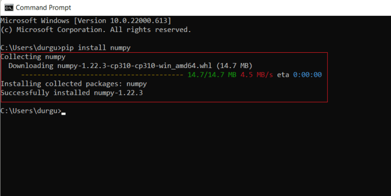

# Listas, Arreglos y Numpy
NumPy (Numerical Python) es una biblioteca de Python utilizada para realizar cálculos numéricos y científicos. Proporcione un objeto de matriz multidimensional de alto rendimiento y herramientas para trabajar con estas matrices.

vamos a instalar la librería NumPy para realizar esto puedes utilizar pip, que es el administrador de paquetes de Python.
1.	Abre una terminal o línea de comandos.
2.	2.	Ejecuta el siguiente comando para instalar NumPy: pip install numpy

3. Ahora verifiquemos si se instalo correctamente con el siguiente comando: pip show numpy
 
Utilizaremos numpy importandolo para
- Crear un arreglo con las siguientes especificaciones
- Crear un arreglo 5x6
- Utilizaremos broadcasting en numpy para crear un arreglo como se especifica:
  Arreglo 4x8
  col1 = llena de 1s, col2 = llena de 2s ... col8 = llena de 8s.
  
  
